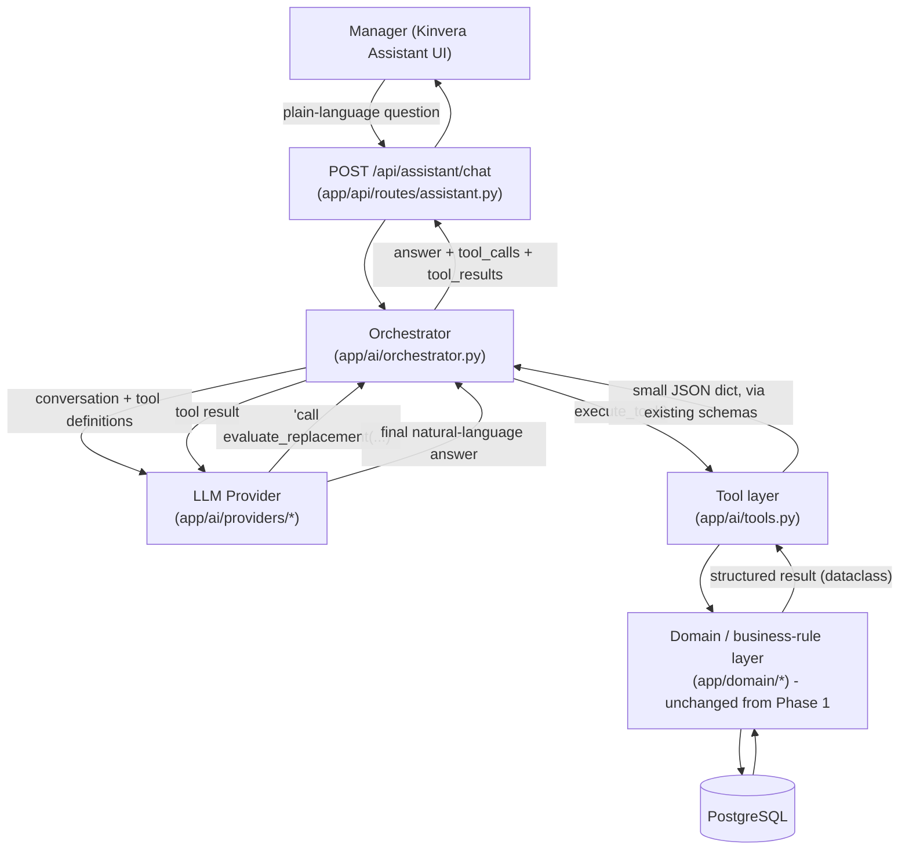

# Grounded AI Architecture (Phase 2)

## Design principle

> **AI explains. Business rules decide.**

Everything in this document exists to make that sentence literally true in code, not just in a
system prompt. The LLM never independently determines eligibility, qualification validity,
availability, staffing sufficiency, assignment conflicts, rest-rule compliance, or extension
consequences. Those are decided exclusively by the deterministic domain layer built in Phase 1
(`backend/app/domain/`) - the same functions the REST API has always used, completely
unchanged by Phase 2.

## What the LLM is, and isn't

The LLM is an **orchestrator and explanation layer**. Given a manager's question, it:

1. decides *which* trusted Kinvera capability is relevant (a tool-calling decision - "this needs
   the eligibility engine," not "I will evaluate eligibility myself"),
2. reads back the structured result that capability returned, and
3. explains it in plain language.

It never sees a database connection, a SQL query, or an ORM object. It only ever sees small,
already-decided JSON objects - the same shapes (`EligibilityResult`, `ExtensionSimulationResult`,
etc.) the frontend has rendered since Phase 1.

## Request flow



The loop between the orchestrator and the LLM (ask → tool request → run tool → feed result back →
ask again) repeats until the model gives a final answer or a safety cap (`MAX_TOOL_ITERATIONS = 5`)
is reached.

## Why the tool layer is thin

Every function in `app/ai/tools.py` does exactly three things: resolve any plain-language names,
call **one** existing domain function unchanged, and convert the result with an **existing**
Pydantic schema from `app/schemas/`. None of the six tools contains an `if` statement that decides
an operational outcome. If `evaluate_replacement_eligibility()` ever changes in `app/domain/`, the
AI assistant's answers change automatically and consistently with the REST API and the frontend -
there is no second copy of the rule to fall out of sync.

| Tool | Wraps |
|---|---|
| `search_employees` | Employee query (same matching as the `/api/employees` route) |
| `get_relief_due` | `app/domain/relief.py: get_relief_due()` |
| `evaluate_replacement` | `app/domain/eligibility.py: evaluate_replacement_eligibility()` |
| `find_replacement_candidates` | `app/domain/replacement.py: find_replacement_candidates()` |
| `simulate_extension` | `app/domain/simulation.py: simulate_extension()` |
| `get_staffing_status` | `app/domain/staffing.py: get_staffing_coverage()` |

All six are read-only. No tool in the registry can call `.add(`, `.delete(`, or `.commit(` on the
database session - this is verified by an automated test that scans the AI layer's source
(`tests/backend/test_ai_orchestrator.py::test_ai_layer_source_contains_no_mutating_database_calls`),
not just asserted in prose.

## Why structured results, not just prose, reach the frontend

`POST /api/assistant/chat` returns three things, not one:

```json
{
  "answer": "...",            // the LLM's natural-language explanation
  "sources": ["evaluate_replacement"],  // which trusted capability produced the fact
  "tool_results": [{"tool": "evaluate_replacement", "result": {"eligible": false, "checks": [...]}}]
}
```

`tool_results` is the raw, deterministic data the tool returned - completely independent of
whatever the model's `answer` text says. The frontend's `AssistantToolResultCard` component
renders its eligibility badges, staffing tables, and event timelines from `tool_results`, never by
parsing `answer`. This is the concrete mechanism behind hallucination resistance: even if a model
were to say "Ahmed is eligible" while the tool result says `"eligible": false`, the badge the
manager actually sees is still red, because it was never derived from the sentence in the first
place. `test_ai_orchestrator.py::test_hallucination_resistance_structured_result_ignores_contradictory_text`
proves this with a scripted, deliberately-wrong model response.

## Ambiguity handling

`app/ai/employee_lookup.py: resolve_employee_by_name()` never guesses. If a name matches more than
one active employee (and isn't an exact, unique full-name match), it raises `AmbiguousEmployeeError`
carrying every match's id, role, and site. The tool layer turns this into
`{"status": "ambiguous", "candidates": [...]}` and hands it straight to the model - the system
prompt instructs the model to ask the manager which one they meant, using exactly that list. The
model is structurally incapable of resolving the ambiguity itself, because the tool never gives it
a resolved employee to work with.

## Provider abstraction

`app/ai/providers/base.py` defines `LLMProvider`, a vendor-neutral interface
(`run_turn(history, tools, system_prompt) -> AssistantTurn`) using Kinvera's own conversation
representation (`ConversationTurn`, `ToolCall`, `AssistantTurn`). Two implementations exist:

- `AnthropicProvider` - the real provider, translating to and from Anthropic's Messages API. This
  is the only file in the codebase that imports the `anthropic` package.
- `FakeProvider` - a scripted, deterministic provider used by every automated test. No test in
  this repository makes a live LLM API call.

Swapping in a different vendor later means adding one new file in `app/ai/providers/` and one
branch in `app/ai/provider_factory.py` - nothing in the tool layer, the orchestrator, or the API
route needs to change.

## Conversation state

Conversation history is kept **in memory**, per `conversation_id`, for the lifetime of the running
backend process (`app/ai/orchestrator.py: ConversationStore`). This is a deliberate Phase 1/2
scope decision: it's enough to demonstrate multi-turn follow-ups in a single session, but it is
lost on restart and isn't safe across multiple backend instances. A production version would
persist conversations in PostgreSQL instead - an additive change, not a rearchitecture.

## AI limitations (stated plainly, per the project's own principle)

- The AI does not independently determine eligibility, qualification validity, staffing
  sufficiency, or any other operational conclusion - only the domain layer does.
- The AI cannot modify workforce records in Phase 2. No tool in the registry writes to the
  database; there is no "commit this simulation" or "approve this extension" capability.
- Extension-simulation results the assistant describes are always hypothetical previews - nothing
  is changed in the database by asking about one, in the assistant or anywhere else in Kinvera.
- All underlying data is synthetic (Ironbridge Field Operations is a fictional company).
- The assistant's natural-language answer is only as good as the model's summary of the tool
  result it was given; the structured `tool_results` field, not the prose, is Kinvera's source of
  truth, and that's what the frontend renders as fact.
- Conversation history does not persist across a backend restart (see above).
- No live LLM credential was available while building Phase 2 in this environment; the real
  `AnthropicProvider` is implemented and unit-tested for its message translation, but end-to-end
  behavior against a live model has not been exercised - only against `FakeProvider`.
