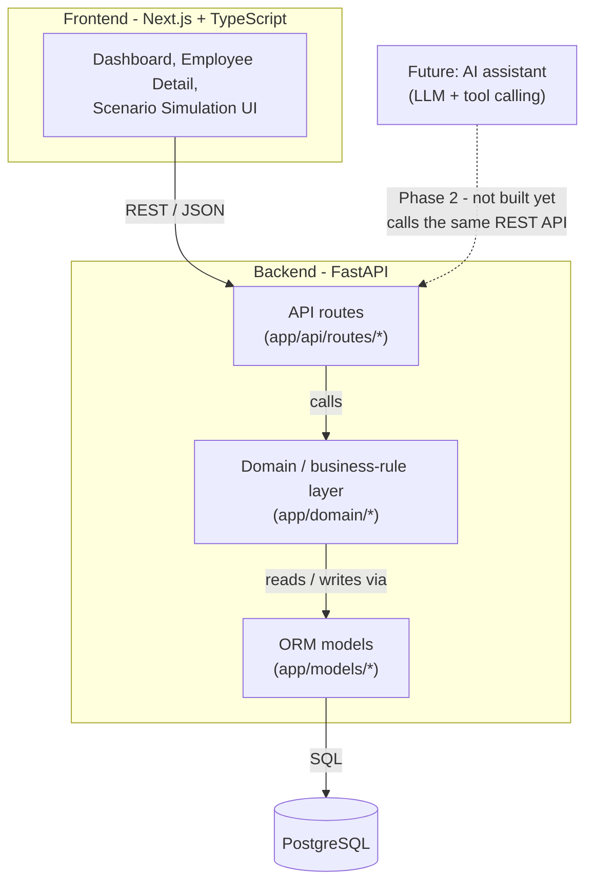

# Architecture

## Guiding principle

> **AI explains. Business rules decide.**

Every conclusion this system reaches about workforce eligibility,
qualification compliance, availability, staffing sufficiency, or
operational conflict comes from ordinary, deterministic Python code
evaluating structured database records - never from a language model.
Phase 1 built the deterministic foundation with no AI at all, on
purpose, to make that separation concrete before an AI layer was ever
introduced. Phase 2 added a grounded AI assistant on top without
touching that foundation - see [AI integration (Phase 2)](#ai-integration-phase-2)
and [docs/ai-architecture.md](./ai-architecture.md).

## System overview



## Layers

**Frontend (`frontend/`)** - Next.js (App Router) + React + TypeScript.
Client components fetch JSON from the FastAPI backend and render it.
The frontend has no business logic of its own: every badge, status,
and eligibility result it shows is data the backend already decided,
formatted for display. If a page needs to know whether someone is
"eligible", it asks the API - it never re-derives that from raw dates
itself.

**API routes (`backend/app/api/routes/`)** - one file per resource
(employees, sites, relief, replacement, simulation, ...). A route
handler's job is limited to: parse the request, call one domain
function, convert the result to a Pydantic response schema. No route
handler contains an `if` statement that decides eligibility, staffing
sufficiency, or risk - that would duplicate logic the domain layer
already owns.

**Domain / business-rule layer (`backend/app/domain/`)** - plain
Python functions and dataclasses, with no FastAPI or HTTP concepts in
them. This is where every rule described in
[business-rules.md](./business-rules.md) actually lives:

| Module | Responsibility |
|---|---|
| `eligibility.py` | The replacement-eligibility engine - the one function every other module reuses to decide "can this person do this job, here, now?" |
| `relief.py` | Relief-due lookups ("who needs relief in N days?") |
| `staffing.py` | Minimum-vs-actual headcount by site + role |
| `simulation.py` | Non-destructive assignment-extension impact simulation |
| `replacement.py` | "Who can replace this assignment?" search |
| `qualifications.py` | Deriving valid/expiring/expired status from dates |
| `dashboard.py` | Assembling the dashboard's KPI summary from the above |
| `results.py` | The structured result types (`EligibilityResult`, `RuleCheck`, `ExtensionSimulationResult`, ...) every rule function returns |

Because every rule returns a structured result (see `results.py`)
rather than a bare `True`/`False`, the API layer, the frontend, and a
future AI layer can all consume the *same* explanation of *why* a
decision came out the way it did.

**ORM models (`backend/app/models/`)** - SQLAlchemy classes mapping
directly to the tables described in
[database/schema.sql](../database/schema.sql). These are intentionally
"dumb": they describe structure and relationships, not behavior. See
that file (and its comments) for how Employee, Role, Site,
Qualification, Assignment, and WorkforceMovement relate to each other.

**Database (PostgreSQL)** - the single source of truth for all
workforce data. Schema changes are made through Alembic migrations
(`backend/alembic/versions/`), never by hand-editing a live database.

## Why the eligibility engine is shared

`app/domain/eligibility.py` exposes one function,
`evaluate_replacement_eligibility`, and it is the *only* code in the
system that decides eligibility. Three different features call it:

1. The **replacement search** endpoint (`GET /api/assignments/{id}/replacement-candidates`) - "who can replace this person right now?"
2. The **extension-simulation engine** (`POST /api/assignments/{id}/simulate-extension`) - when a proposed extension creates a downstream gap, it evaluates alternatives for that gap using this same function.
3. (Phase 2) The **AI assistant's tool layer** would call the same function through the same API route - never its own copy of the logic.

If eligibility rules ever need to change, they change in exactly one
place, and every feature that depends on eligibility changes
consistently.

## Extension-simulation engine

`simulate_extension(db, assignment_id, extension_days)` never writes
to the database - it computes a proposed new end date locally and only
*reads* other records to see what that change would collide with. It
walks one hop of the "relief chain":

```
target assignment (being extended)
  -> its planned reliever, if any
      -> the reliever's own next commitment, if any
          -> whoever THAT commitment was going to relieve
```

At each hop, it asks one concrete, testable question (does the
reliever's start date still work? does their next commitment now
overlap? does that leave a site short-staffed?) and returns a
structured `ExtensionSimulationResult` - a list of `ImpactEvent`s, any
`StaffingCoverageItem` shortages found, and eligible/rejected
alternatives (found via the same eligibility engine above). See
[business-rules.md](./business-rules.md) for the exact rule and the
seeded John Smith scenario that demonstrates it end-to-end.

Phase 1 deliberately walks only this one hop rather than an
arbitrary-depth chain - enough to demonstrate a real, multi-site
downstream conflict without turning into an open-ended scheduling
solver. A deeper chain (mirroring further downstream reliefs) is a
natural, additive extension for a later phase.

## AI integration (Phase 2)

**Implemented.** What follows was the Phase 1 plan for a later phase; it is now built exactly as
described, in `backend/app/ai/`. See [docs/ai-architecture.md](./ai-architecture.md) for the full
detail (request-flow diagram, tool layer, provider abstraction, hallucination-resistance
mechanism, ambiguity handling, and stated limitations).

```
Operations manager asks a question
        |
        v
LLM identifies the appropriate trusted tool
(e.g. check_replacement_eligibility, simulate_extension)
        |
        v
LLM calls the *existing* FastAPI endpoint - the same one
the frontend already calls
        |
        v
Backend runs the *existing* deterministic domain function
        |
        v
Backend returns a structured result (EligibilityResult,
ExtensionSimulationResult, ...) - unchanged from what's
documented in business-rules.md
        |
        v
LLM explains that verified result in natural language
```

Concretely, for "Can Ahmed replace John Smith?":

- **Wrong architecture:** the LLM reads employee records and decides eligibility itself.
- **Correct architecture:** the LLM calls something like `check_replacement_eligibility(target_assignment_id, candidate_employee_id)`, which is a thin wrapper around the same `evaluate_replacement_eligibility` function this phase already built and tested. The backend returns `{"eligible": true, "checks": [...]}`. The LLM's only job is to explain that result in plain language - it never overrides or second-guesses it.

This is why Phase 1 spent its effort on structured, rule-by-rule
results instead of plain booleans: an LLM (or a human) explaining "not
eligible" needs the *reason* the boolean says so, and that reason has
to come from the same trusted source as the boolean itself.

No API keys, prompt templates, or LLM SDK dependencies exist anywhere
in this codebase yet - that is intentional scope discipline, not an
oversight.
