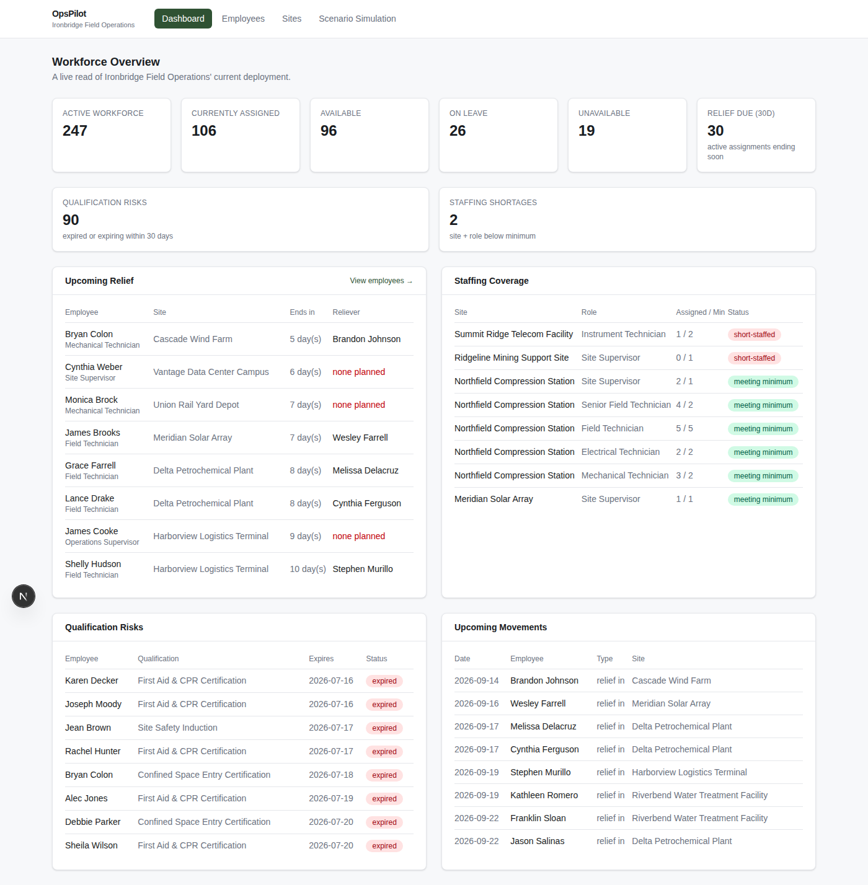
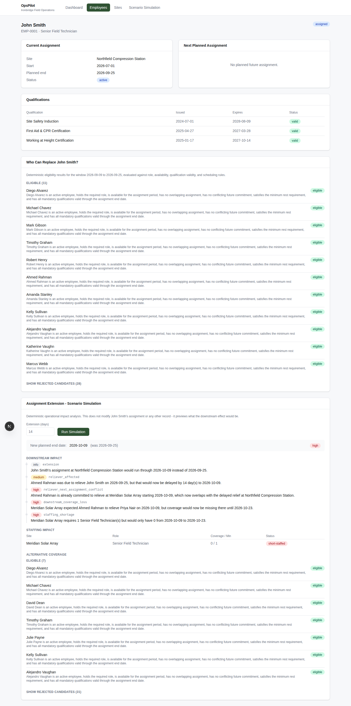
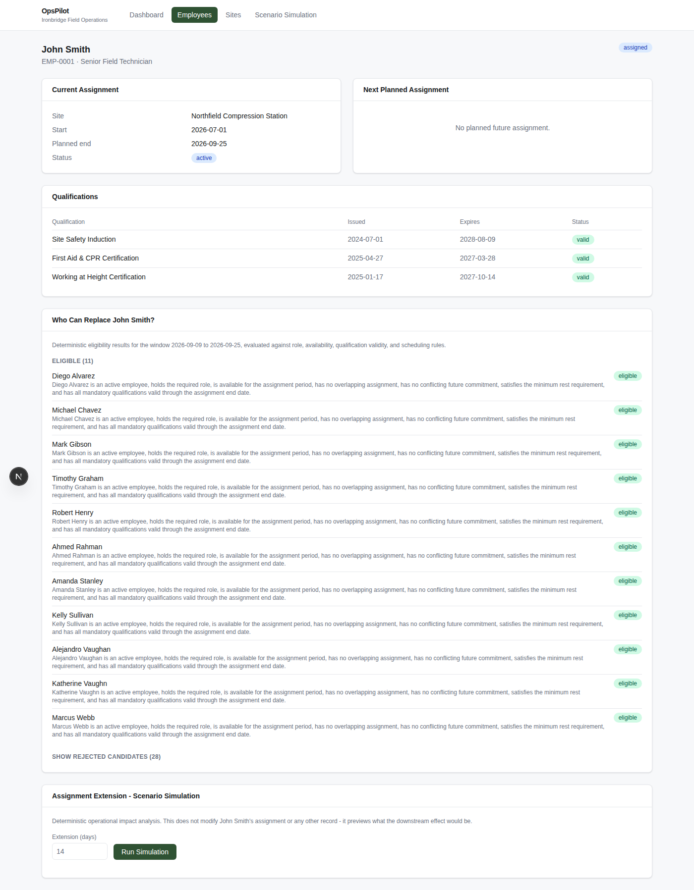
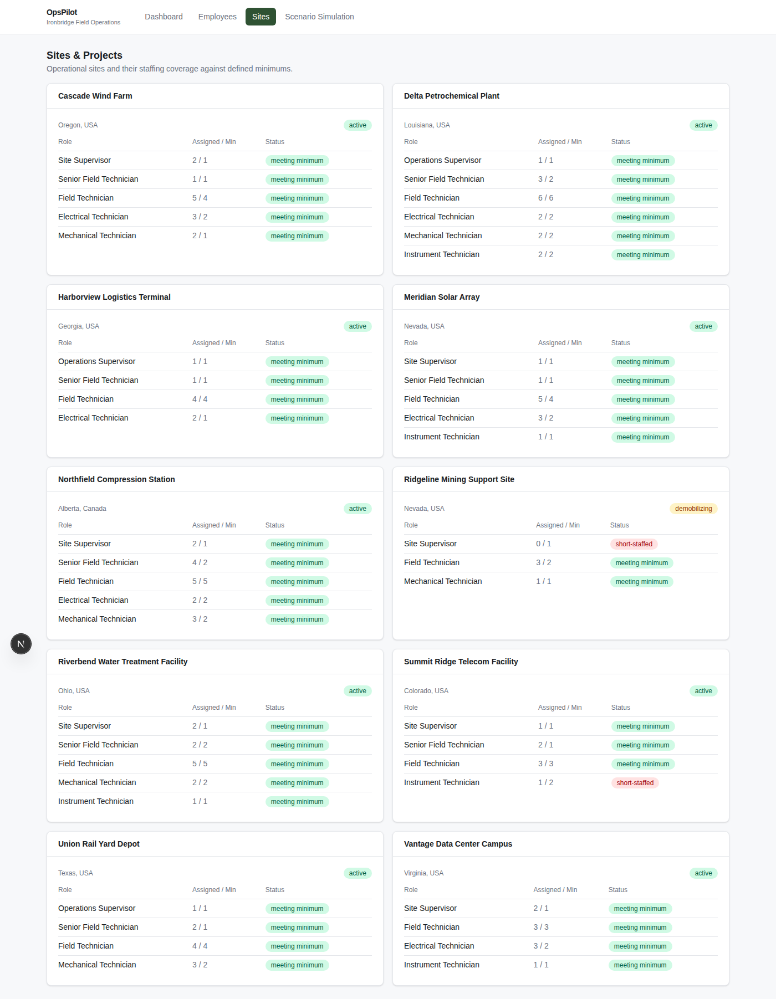

# OpsPilot

**AI-ready Workforce Operations Platform**

A portfolio project demonstrating a deterministic workforce-operations
backend and dashboard for a fictional field-services company,
architected so a grounded AI assistant can be added later without ever
letting an LLM make an operational decision.

> All company names, employees, sites, and data in this project are
> synthetic. OpsPilot is not affiliated with any real organization.

## Design Principle

> **AI explains. Business rules decide.**
>
> The LLM layer planned for a later phase will never independently
> determine workforce eligibility, qualification compliance,
> availability, staffing sufficiency, or operational conflicts. Those
> conclusions come from deterministic backend logic operating on
> structured database records. The AI layer will only call trusted
> backend tools and explain their results in plain language.

## The Problem

Workforce planning in field-services, industrial, and project-based
operations is often fragmented across spreadsheets, emails, phone
calls, and the individual operational knowledge of a handful of
schedulers. Questions like *"who needs relief soon?"*, *"who can
replace this person?"*, and *"what happens if we extend someone's
assignment?"* get answered from memory and gut feel, and the reasoning
behind the answer usually isn't written down anywhere.

## The Solution

OpsPilot combines:

- **Structured workforce data** - employees, roles, sites, qualifications, assignments, and movements in a normalized PostgreSQL schema.
- **Deterministic business rules** - a reusable eligibility engine, relief-due logic, and staffing-coverage checks that return rule-by-rule evidence, not just a yes/no.
- **Scenario simulation** - a non-destructive "what happens if this assignment runs N days longer?" tool that traces the real downstream conflict through the relief chain.
- **A grounded-AI-ready architecture** - every rule above is exposed as a plain function and a REST endpoint today, specifically so a future AI assistant can call them as tools and explain the results, rather than reasoning about eligibility itself.

## The Company

**Ironbridge Field Operations** is a fictional field-services company
running ~250 technical and supervisory staff across 10 operational
sites - compression stations, solar and wind installations, water
treatment, rail and logistics depots, telecom and data-center
facilities, a petrochemical plant, and a demobilizing mine-support
site. The synthetic dataset deliberately includes staffing shortages,
expired/expiring qualifications, and a fully worked relief-chain
scenario (see below) so every feature has something real to
demonstrate.

## Feature Summary

| Feature | Where |
|---|---|
| Workforce KPI dashboard | `/` |
| Employee roster with search | `/employees` |
| Employee detail: role, assignments, qualifications, history | `/employees/[id]` |
| "Who can replace this employee?" eligibility search | Employee detail page |
| Assignment-extension scenario simulation | Employee detail page, `/simulate` |
| Sites & staffing coverage | `/sites` |
| Relief-due, qualification-risk, and staffing-shortage views | Dashboard |

## Screenshots

| Dashboard | Scenario Simulation |
|---|---|
|  |  |

| Employee Detail | Sites & Staffing Coverage |
|---|---|
|  |  |

## Architecture Overview

```
Next.js (TypeScript) frontend
        |  REST / JSON
        v
FastAPI routes  ->  Domain / business-rule layer  ->  SQLAlchemy models
                                                              |
                                                              v
                                                         PostgreSQL
```

Full detail, including a diagram of how the (future) AI assistant
attaches to this same stack, is in [docs/architecture.md](docs/architecture.md).

## Technology Stack

- **Frontend:** Next.js (App Router), React, TypeScript, Tailwind CSS
- **Backend:** Python, FastAPI, SQLAlchemy, Alembic (migrations)
- **Database:** PostgreSQL
- **Testing:** pytest (backend business rules + API), TypeScript compiler + ESLint (frontend)

## Data Model Overview

Roles, Sites, and Qualifications are reference data. Employees hold a
Role and zero or more EmployeeQualifications (each with issue/expiry
dates). Assignments deploy an Employee to a Site under a Role for a
date window, and can point at the assignment they relieve
(`relieving_assignment_id`), forming the relief chain the simulation
engine walks. WorkforceMovements are the discrete, dated events
(mobilize, rotate out, relieve, etc.) around those assignments.
SiteStaffingRequirements and RoleQualificationRequirements are the two
small "rules as data" tables the eligibility and staffing engines
read from. Full schema: [database/schema.sql](database/schema.sql).

## Deterministic Rules

Every eligibility, relief, staffing, and simulation rule is documented
- with the exact check names, what they test, and worked examples -
in [docs/business-rules.md](docs/business-rules.md). That document
also walks through the seeded John Smith scenario end-to-end.

## Sample Use Cases

- **"Who needs relief in the next 30 days?"** -> Dashboard's Upcoming Relief widget, or `GET /api/relief/due?window_days=30`.
- **"Who can replace John Smith?"** -> John Smith's employee detail page, or `GET /api/assignments/{id}/replacement-candidates`.
- **"What happens if John Smith stays 14 more days?"** -> Scenario Simulation on his employee detail page (or `/simulate`), or `POST /api/assignments/{id}/simulate-extension`. This reproduces the exact downstream conflict documented in [business-rules.md](docs/business-rules.md#seeded-demonstration-scenario): a delayed reliever, a missed commitment at a second site, a staffing shortage, and a correctly-filtered list of eligible alternatives.

## Setup Instructions

### Prerequisites

- Python 3.11+
- Node.js 20+
- PostgreSQL 14+

### Backend

```bash
cd backend
python -m venv .venv && source .venv/bin/activate
pip install -r requirements.txt

# create the database (see database/README.md for the exact commands)
cp .env.example .env   # adjust DATABASE_URL if needed
alembic upgrade head
python -m app.seed.generate_synthetic_data

uvicorn app.main:app --reload
# API now at http://localhost:8000, interactive docs at /docs
```

### Frontend

```bash
cd frontend
cp .env.example .env.local   # NEXT_PUBLIC_API_BASE_URL, defaults to localhost:8000
npm install
npm run dev
# App now at http://localhost:3000
```

## Testing

```bash
# Backend business rules + API integration tests (from the opspilot/ root)
pytest

# Frontend type checking and linting
cd frontend
npx tsc --noEmit
npx eslint .
```

The pytest suite covers, at minimum: every eligibility rule in
isolation (valid replacement, wrong role, inactive/unavailable
employee, expired qualification, qualification expiring mid-assignment,
overlapping assignment, future-commitment conflict, rest-rotation
violation), relief-due window boundaries, and the extension-simulation
engine (non-mutation, date math, conflict detection, staffing-shortage
detection, and the full seeded John Smith +14-day scenario).

## Future AI Architecture

**No AI is integrated in Phase 1.** The planned Phase 2 assistant would
let an operations manager ask questions like *"Can Ahmed replace John
Smith?"* in natural language. The LLM would identify and call the
existing `check_replacement_eligibility`-style backend endpoint (the
same one the frontend already calls), receive the same structured
`{"eligible": ..., "checks": [...]}` result documented in
[business-rules.md](docs/business-rules.md), and explain it - never
evaluate eligibility itself. Full detail in
[docs/architecture.md](docs/architecture.md#future-ai-integration).

## Current Limitations

See [docs/business-rules.md#limitations](docs/business-rules.md#limitations)
for the specific rule approximations (exact-only role matching,
availability as a snapshot rather than a leave calendar, a
one-hop-deep simulation chain, single-number staffing minimums).
Beyond the rules themselves: there is no authentication, no
deployment configuration, and no AI integration in this phase -
deliberately, per scope.

## Roadmap

- **Phase 2:** Grounded AI operations assistant using LLM tool/function calling against this same deterministic API.
- Leave/absence calendar to replace the availability-status snapshot.
- Multi-hop relief-chain simulation.
- Role-substitution rules (which roles can cover which gaps).
- Authentication and role-based access for operations managers vs. read-only viewers.
- Deployment configuration (containerization, hosted Postgres, CI).

## Repository Structure

```
opspilot/
├── frontend/        Next.js + TypeScript dashboard
├── backend/         FastAPI app: models, domain rules, API routes, seed data
├── database/        Schema reference and local setup notes
├── tests/backend/   pytest suite (business rules + API integration)
├── docs/            architecture.md, business-rules.md, screenshots/
├── README.md
├── .gitignore
└── LICENSE
```
